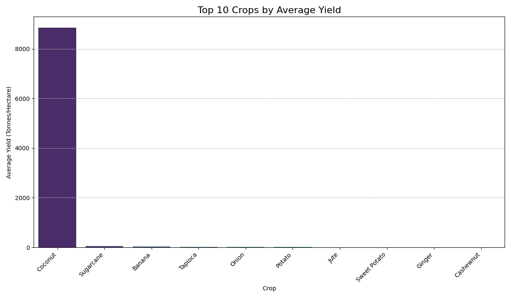

# 🌾 Indian Crop Yield Prediction using Machine Learning

A machine learning project to predict crop yield (Tonnes/Hectare) for various crops across India. The workflow covers data engineering, feature engineering, exploratory data analysis, and regression model training. The final model is deployed in an interactive Streamlit web app.

---
## 📊 Datasets Used

This project integrates three distinct datasets to create a comprehensive feature set for the model.

### Crop Production Data (Base Dataset)
- **Source:** Crop-wise Area–Production–Yield (APY) from the India Data Portal  
- **Description:** The primary dataset, containing district-level data on State, District, Year, Season, Crop, Area, and Production. It forms the foundation of our analysis.

### Agronomic Data
- **Source:** India State Agriculture Production Data (1997–2020) via Kaggle  
- **Description:** Provides state-level agronomic data, including Annual Rainfall, Fertilizer usage, and Pesticide usage, which are critical for explaining yield variations.

### Soil Data
- **Source:** SoilGrids (ISRIC – World Soil Information)  
- **Description:** A global dataset offering high-resolution geospatial data on soil properties. For this project, soil pH data across India was downloaded and processed, then aggregated to the district level.

---

## ⚙️ Data Engineering & Merging

Combining these datasets was a complex process that required careful data cleaning and a strategic merging workflow to avoid common pitfalls like data duplication.

**Data Preparation:** Each dataset was loaded, and key columns were standardized (e.g., renaming, converting year from '1998-99' to 1998).

**Aggregation:** The agronomic dataset had multiple entries for the same State, Year, and Crop (due to different seasons). To prevent a row explosion during the merge, this dataset was aggregated by taking the mean of the agronomic features for each unique (State, Year, Crop) combination.

**Merging Strategy:**
- The primary Crop Production data was merged with the aggregated Agronomic Data using a left merge on ['State', 'Year', 'Crop'].
- The resulting DataFrame was then merged with the Soil Data using a left merge on District.

**Handling Missing Values:** Null values created during the merges were handled using a sophisticated hybrid approach: first, interpolation was used to fill gaps in the time-series data, and any remaining nulls were filled with the mean value for that specific state or crop.

---

## 📈 Exploratory Data Analysis (EDA) & Insights

Visualizing the merged data was crucial for understanding its characteristics and making key decisions.

**Feature Correlation:**  
The initial correlation heatmap showed very low linear correlation between numerical features like Rainfall and the Yield. This was a key insight, indicating that the relationships in the data are complex and non-linear, and that categorical features like Crop and State are extremely important.
  

**Top Crops by Yield:**  
This plot revealed a massive outlier: the Coconut crop had a yield thousands of times higher than any other. This was identified as a data quality issue, likely due to the yield being recorded in a different unit (nuts/hectare instead of tonnes/hectare). To prevent this outlier from skewing the model, all data for the 'Coconut' crop was removed.
  
**Top States by Yield:**  
This visualization provided a clear overview of the most productive states on average, highlighting regional differences in agricultural productivity.
  
---

## 🤖 Model Training and Evaluation

Two different models were trained to find the best approach for this complex dataset.

### 1. Initial Model: Linear Regression
**Description:**  
A `LinearRegression` model was trained as a baseline. Categorical features (State, District, Season, Crop) were encoded using TargetEncoder, and all features were scaled.

**Performance:**  
- Mean Absolute Error (MAE): 3.25  
- R-squared (R²): 0.22

**Analysis:**  
The R-squared value of 0.22 was very low. This confirmed our hypothesis from the EDA: a simple linear model is not powerful enough to capture the complex, non-linear relationships and interactions between the features in this dataset. It was a necessary first step that proved we needed a more advanced model.

### 2. Final Model: Random Forest Regressor
**Description:**  
To handle the non-linear patterns, a `RandomForestRegressor` was trained on the exact same data.

**Performance:**  
- Mean Absolute Error (MAE): 1.00  
- R-squared (R²): 0.28

**Analysis:**  
The Random Forest model showed a significant improvement. The MAE dropped to 1.00, meaning the model's predictions are, on average, much more accurate. While the R-squared of 0.28 is still modest, it reflects the inherent complexity and randomness of agricultural data. This model provides a solid balance of accuracy and explanatory power given the available features. 
  

  
---
## 📁 Project Structure
```
Crop_Yield_prediction/
├── data/
│   |── raw_data/                           # Crop, soil, and weather CSVs    you have to download the dataset as it is more mb
│   ├── After_EDA_crop_data.csv             # cleaned and merged data
│   └── final_cleaned_crop_data.csv         # data After doing EDA
├── images/                                 # Plots and visualizations for documentation
│  
├── notebooks/                              # code
│   ├── data_cleaning_and_merging.ipynb
│   ├── EDA.ipynb
│   ├── model_trainig.ipynb
│   └── soil_data_dowload.ipynb
├── app.py                                   # Streamlit web application
├── encoder.pkl                              # Saved encoder for categorical features
├── model.pkl                                # Trained Random Forest model  ,this will not be uploded in git as it is of size 2gb
├── scaler.pkl                               # Saved scaler for feature normalization
└── README.md                                # Project-specific documentation
            
```

## 🚀 How to Run the Project

### 1. Installation
```bash
git clone <your-repo-link>
cd <your-repo-folder>
pip install -r requirements.txt
```

### 2. Model Training
Run the Jupyter Notebook to retrain or explore data. Generates `model.pkl`, `encoder.pkl`, `scaler.pkl`.  
File: `notebooks/model_training.ipynb`

### 3. Launch the Web App
```bash
streamlit run app.py
```
File: `app.py`  
Opens the interactive crop yield predictor in your browser.

---


  
